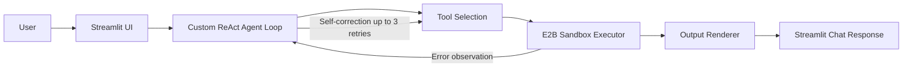
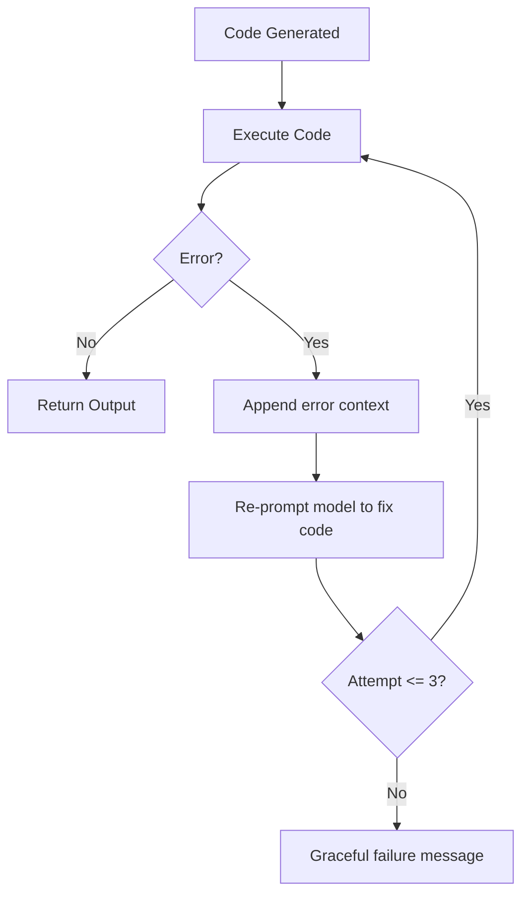

<div align="center">

# 🤖 AI Data Analyst Agent

Conversational AI data analyst that lets you upload structured datasets and ask questions in plain English.  
The agent writes Python, executes it (secure sandbox first), retries on errors, and returns charts/tables/insights.

[](https://python.org)
[](https://langchain.com)
[](https://openai.com)
[](https://streamlit.io)
[](https://e2b.dev)

</div>

---

## 📌 Project Overview

This is a portfolio-grade, agentic AI application focused on **real execution**, not just chat responses.

- Upload data files: **CSV, Excel (.xlsx/.xls), JSON**
- Ask natural-language analysis questions
- Agent performs **Thought → Action → Observation** cycles
- Generated code runs in **E2B sandbox** (with local subprocess fallback)
- On failure, agent performs **automatic self-correction (up to 3 retries)**
- Outputs are rendered as **tables, charts, and text summaries**
- Multi-turn memory supports follow-ups like “now break that down by month”
- Download outputs as **PNG** (charts) and **CSV** (tables)

---

## ✅ Current Status

- Phase 1: Foundation + file parsing + UI shell — Complete
- Phase 2: LLM + custom ReAct loop + local execution — Complete
- Phase 3: Output rendering (table/chart/text) — Complete
- Phase 4: Self-correction loop — Complete
- Phase 5: E2B sandbox + session memory + export buttons — Complete
- Phase 6: Testing + README + Docker hardening — In Progress

---

## 🧠 Architecture



### Self-Correction Loop



---

## 🧩 Tech Stack

| Layer | Technology |
|---|---|
| Language | Python 3.11+ |
| Frontend | Streamlit |
| Agent | Custom ReAct loop |
| LLM Providers | OpenAI GPT-4o (default), Anthropic Claude Sonnet |
| Structured Output | Pydantic v2 + instructor |
| Data | Pandas, NumPy |
| Charts | Matplotlib, Seaborn, Plotly |
| Execution | E2B sandbox (primary), subprocess fallback |
| Testing | pytest |
| Containerization | Docker |

---

## 📂 Project Structure

```text
app.py
agent/
  core.py
  memory.py
  prompt.py
  tools.py
executor/
  sandbox.py
  local_exec.py
parser/
  file_parser.py
renderer/
  output.py
tests/
  test_agent.py
Dockerfile
requirements.txt
README.md
```

---

## 🚀 Local Setup (Recommended)

### 1) Clone

```bash
git clone https://github.com/kushalmehta2004/ai-data-analyst-agent.git
cd ai-data-analyst-agent
```

### 2) Create virtual environment

**Windows (PowerShell):**
```powershell
python -m venv .venv
.\.venv\Scripts\Activate.ps1
```

**macOS/Linux:**
```bash
python -m venv .venv
source .venv/bin/activate
```

### 3) Install dependencies

```bash
pip install -r requirements.txt
```

### 4) Configure environment variables

Create `.env` from `.env.example` and set keys:

```env
LLM_PROVIDER=openai            # openai | anthropic
OPENAI_API_KEY=sk-...
ANTHROPIC_API_KEY=sk-ant-...   # required only when LLM_PROVIDER=anthropic
E2B_API_KEY=...                # optional; fallback to local subprocess if omitted
```

### 5) Run app

```bash
streamlit run app.py
```

Open: http://localhost:8501

---

## 🐳 Docker Setup

### Build image

```bash
docker build -t ai-data-analyst-agent .
```

### Run container

```bash
docker run -p 8501:8501 --env-file .env ai-data-analyst-agent
```

App URL: http://localhost:8501

---

## 💬 Example Questions

### Titanic-style dataset
- What is the survival rate by passenger class?
- Compare average fare by class and gender.
- Show class-wise passenger counts.

### Superstore-style sales dataset
- Show me a bar chart of sales by region.
- Which category has the highest total sales?
- Show monthly sales trend as a line chart.

### COVID-style cases dataset
- Aggregate total new cases by location.
- Show top 10 locations by new cases.
- Plot rolling average of new cases over time.

---

## 🧪 Testing

Run all tests:

```bash
pytest tests/ -q
```

Phase 6 test coverage includes:
- Unit tests for file parsing (CSV/Excel/JSON, malformed files, file-size guard)
- Self-correction loop behavior
- Column hallucination validation
- Integration-style scenarios for Titanic, Superstore chart output, and COVID aggregation

---

## 🔐 Execution Model

- Primary: **E2B sandbox** (isolated execution environment)
- Fallback: **local subprocess** with timeout
- DataFrame is preloaded as `df`
- Recent table outputs are retained for follow-up analysis via `prior_results`

---

## 📤 Output Types

- **Table output**: rendered in chat + CSV download button
- **Chart output**: rendered in chat + PNG download button
- **Text output**: markdown/code block summaries
- **Agent trace**: expandable “Agent Thinking” section for each response

---

## 🛠 Troubleshooting

- `OPENAI_API_KEY is not set`: add key in `.env` and restart app.
- `ANTHROPIC_API_KEY is not set`: set only when `LLM_PROVIDER=anthropic`.
- E2B unavailable: app automatically falls back to local executor.
- Empty/invalid file upload: ensure valid CSV/Excel/JSON and file size under 50MB.

---

## 🌐 Try It Yourself

- Live demo link: **Coming soon**
- Demo GIF: add your recording at `assets/demo.gif` (recommended 60–90s flow)

---

## 🤝 Why This Project Matters

This project demonstrates practical agent engineering:
- Custom orchestration logic instead of black-box agent wrappers
- Reliable structured extraction for LLM outputs
- Secure code execution patterns
- Automatic error recovery with retry loops
- End-to-end product thinking (UI, backend, tests, and deployment)

---

## 📄 License

MIT

---

<div align="center">

Built with Python · Streamlit · OpenAI/Anthropic · E2B · Pandas

</div>
